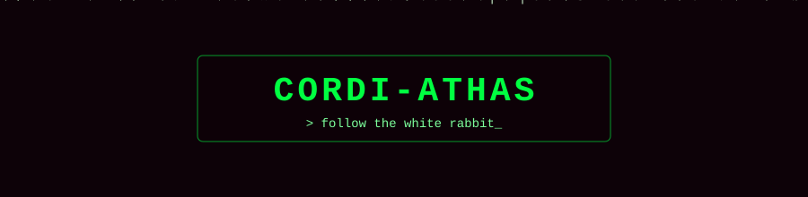

<!-- ░░ MATRIX PROFILE · cordi-athas ░░ -->

<p align="center">
  
</p>

<p align="center">
  <a href="https://github.com/cordi-athas">
    
  </a>
</p>

<p align="center">
  
  
</p>

---

```bash
cordi-athas@nebuchadnezzar:~$ whoami
> indie game developer · web3 builder · content creator

cordi-athas@nebuchadnezzar:~$ cat ./current_mission.txt
> [■■■■■■■■□□] mobile games   → bananagun.games
> [■■■■■■□□□□] solana / defi  → launchpads & token mechanics
> [■■■■□□□□□□] short-form     → motion & storytelling

cordi-athas@nebuchadnezzar:~$ ./take --pill red
> loading construct...
```

### `> SYSTEM.LOADOUT`

<p align="left">
  
  
  
  
  
  
  
  
  
  
</p>

### `> CONSTRUCTS.ONLINE`

| node | signal |
|---|---|
| 🎮 **[bananagun.games](https://bananagun.games)** | mobile game studio, hybrid-casual & puzzle games |
| 📄 **[embeddocxeditor](https://github.com/cordi-athas/embeddocxeditor)** | offline-first DOCX editor in the browser on LibreOffice WASM |
| ⛓️ **solana launchpads** | experimental token mechanics, in the lab |

### `> TELEMETRY`

<p align="center">
  
  
</p>

<p align="center">
  
</p>

<p align="center">
  
</p>

### `> AGENT.HUNT`

<p align="center">
  <picture>
    <source media="(prefers-color-scheme: dark)" srcset="https://raw.githubusercontent.com/cordi-athas/cordi-athas/output/matrix-snake-dark.svg" />
    <source media="(prefers-color-scheme: light)" srcset="https://raw.githubusercontent.com/cordi-athas/cordi-athas/output/matrix-snake.svg" />
    
  </picture>
</p>

---

<p align="center">
  <a href="https://bananagun.games"></a>
  <!-- X / Twitter: kullanıcı adını ekle ve yorumu kaldır -->
  <!-- <a href="https://x.com/KULLANICI_ADI"></a> -->
</p>

<p align="center">
  
</p>
